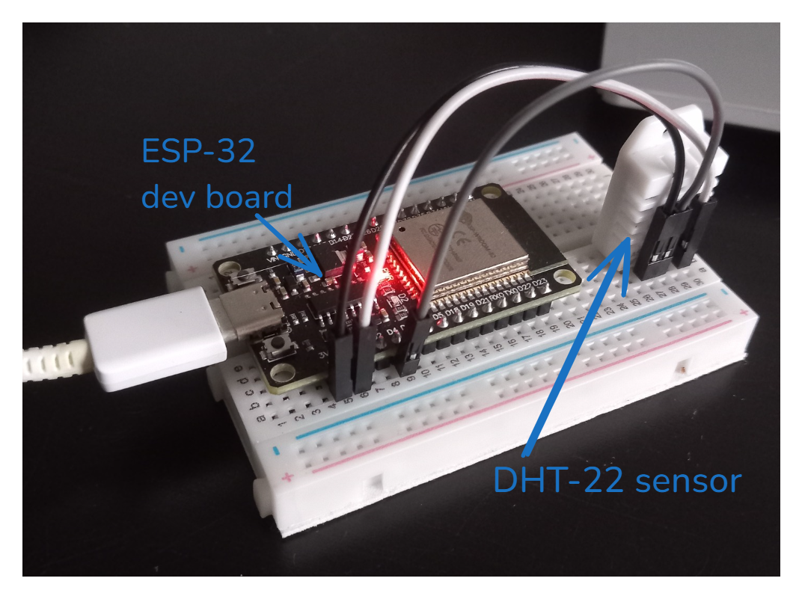

# ESP-32-DHT-22-temperature-sensor
A simple implementation of a DHT-22 sensor with an ESP-32

### What you'll need:
- 1 ESP-32 dev module (at least 30 pins)
- 1 DHT-22 sensor
- 3 jumper cables
- 1 breadboard

 

### How to wire ?
- To supply power to the DHT-22, you'll need to wire the ESP-32's **3v3** pin to the DHT-22's **VCC** pin.

- To transfer data from the sensor to the microcontroller, you'll have to wire the DHT-22's **DATA** pin to the ESP-32's **GPIO 4** pin.\
*(You can use any GPIO pin, but you'll need to modify the source)*

- Wire sensor's **GND** pin to microcontroller's **GND** pin

| ESP32  | DHT22 |
|--------|-------|
| 3v3    | VCC   |
| GPIO 4 | DATA  |
| GND    | GND   |

 

### Flashing:
1) Download and install the [arduino ide](https://www.arduino.cc/en/software).
2) Open the project.
3) Go to *File > preferences* and paste "https://dl.espressif.com/dl/package_esp32_index.json" into the "additionnal boards" text input.
4) Next, you'll need to install *DHT sensor library from Adfruit* in the library manager (3rd icon on the left sidebar).
5) Go to *Tools > board > esp32* and select *ESP32 Dev Module*.
6) Go to *Tools > board > port* and select the correct COM port.
7) Falsh with the top left arrow button !
8) Open the serial monitor, select 115200 baud, and wait for output.
